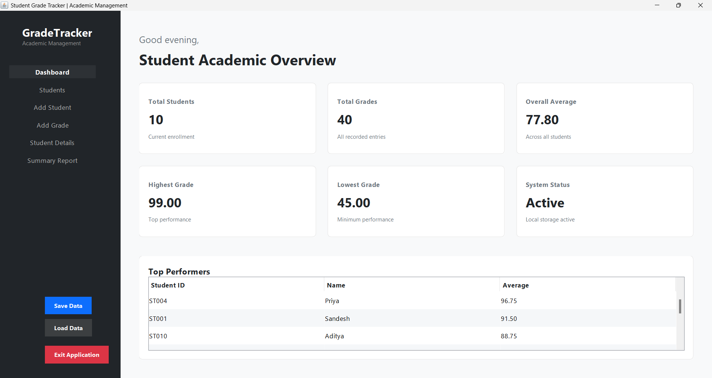
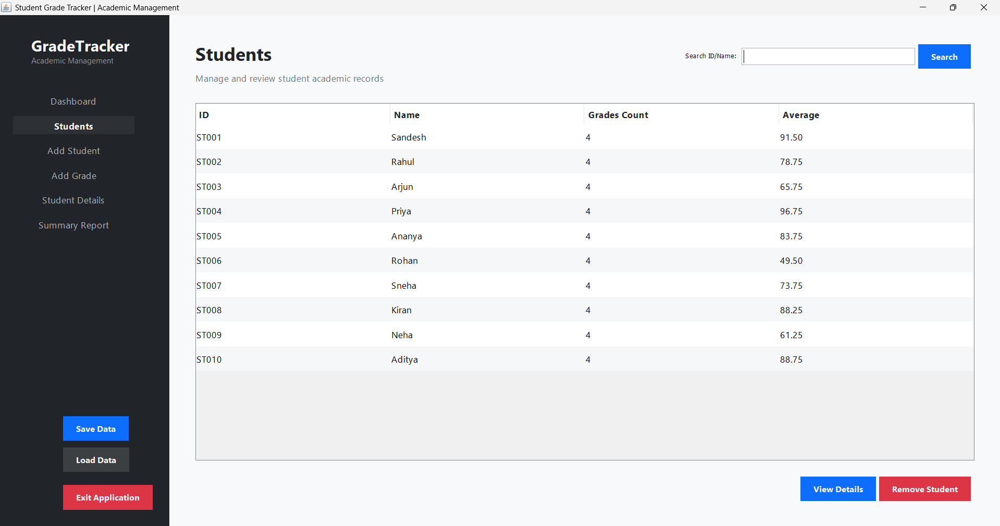
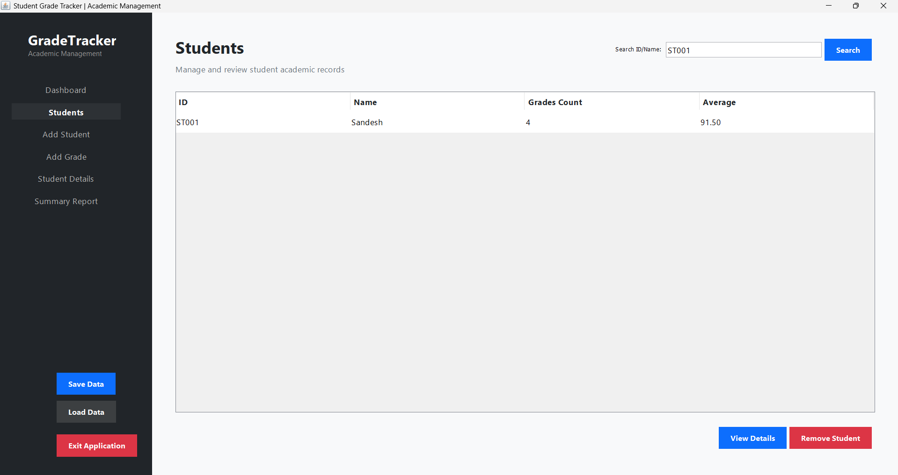
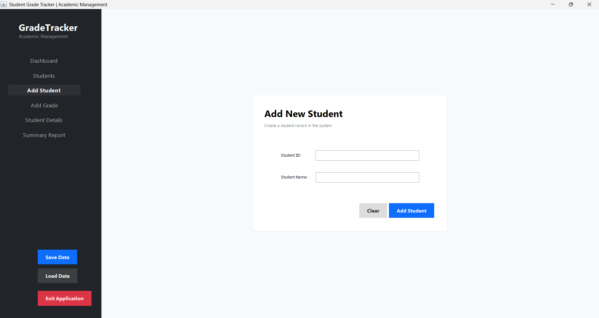
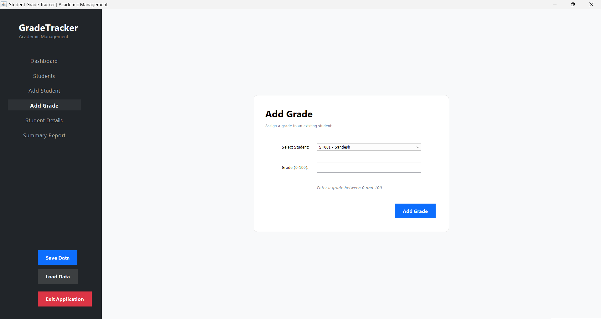
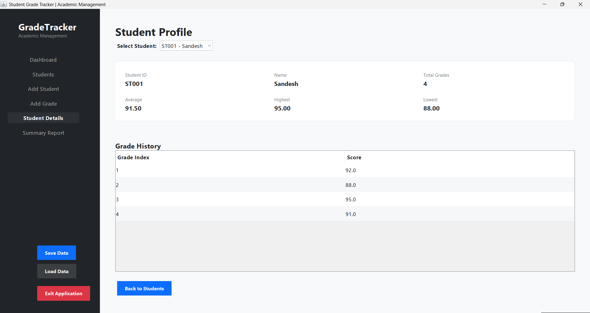
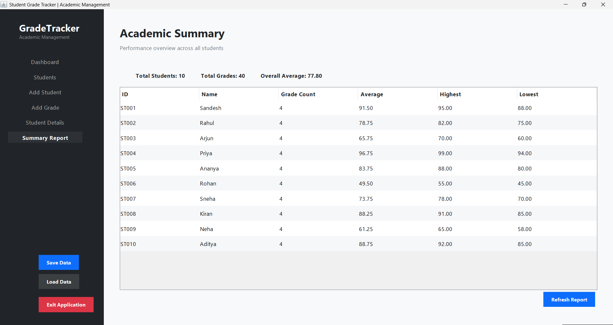

# Student Grade Tracker
 
## Project Overview
The Student Grade Tracker is a professional Java Swing application designed for academic management. It provides a modern, intuitive interface to manage student records, track their academic performance, and generate comprehensive statistics.
 
## CodeAlpha Internship
This project was developed as part of the **CodeAlpha Java Programming Internship** to demonstrate proficiency in Java core concepts, Object-Oriented Programming (OOP), Swing UI development, and data management.
 
## Features
- **Professional Dashboard**: At-a-glance overview of total students, grades, overall average, and top performers.
- **Student Management**: Add and remove students with unique IDs and names.
- **Grade Tracking**: Assign multiple grades (0-100) to students with real-time validation.
- **Detailed Profiles**: View individual student profiles including grade history and personalized academic metrics.
- **Comprehensive Reporting**: Generate a summary report across the entire student body.
- **Data Persistence**: Save and load data using Java Serialization to ensure continuity between sessions.
- **Modern UI**: A sleek interface with a sidebar navigation, responsive layouts, and professional styling.
 
## Technologies Used
- **Java**: Primary programming language.
- **Java Swing**: Used for the graphical user interface.
- **OOP**: Encapsulation, modular design, and separation of concerns.
- **ArrayList**: Used for dynamic storage of students and grades.
- **Java File I/O**: Implemented via `ObjectOutputStream` and `ObjectInputStream` for serialization.
- **Exception Handling**: Robust management of invalid inputs and I/O errors.
 
## Project Structure
- `StudentGradeTrackerGUI.java`: The main application window, handling the UI layout and user interactions.
- `GradeManager.java`: Contains the core business logic for managing students and grades.
- `Student.java`: The data model representing a student's profile.
- `GradeStatistics.java`: Utility class for calculating averages, maximums, and minimums.
- `FileManager.java`: Handles the persistence logic for saving and loading data.
- `Main.java`: Legacy console-based entry point (maintained for compatibility).

## 📸 Application Screenshots

### Dashboard


### Student Management


### Student Search


### Add Student


### Add Grade


### Student Details


### Academic Summary

 
## How to Run
 
### Prerequisites
- Java Development Kit (JDK) installed.
 
### Compilation
Open your terminal and run:
```bash
javac -d out src/*.java
```
 
### Running the Application
Run the following command:
```bash
java -cp out src.StudentGradeTrackerGUI
```
 
## Validation Rules
- **Student IDs**: Must be unique and non-empty.
- **Student Names**: Must be non-empty.
- **Grades**: Must be numeric and within the range of 0.0 to 100.0.
 
## Data Persistence
The application uses Java Serialization to save the student list to `data/students.dat`. This allows all student records and their associated grades to be preserved upon exiting the application.
 
## Author
Developed By Sandesh as part of the CodeAlpha Java Internship.
